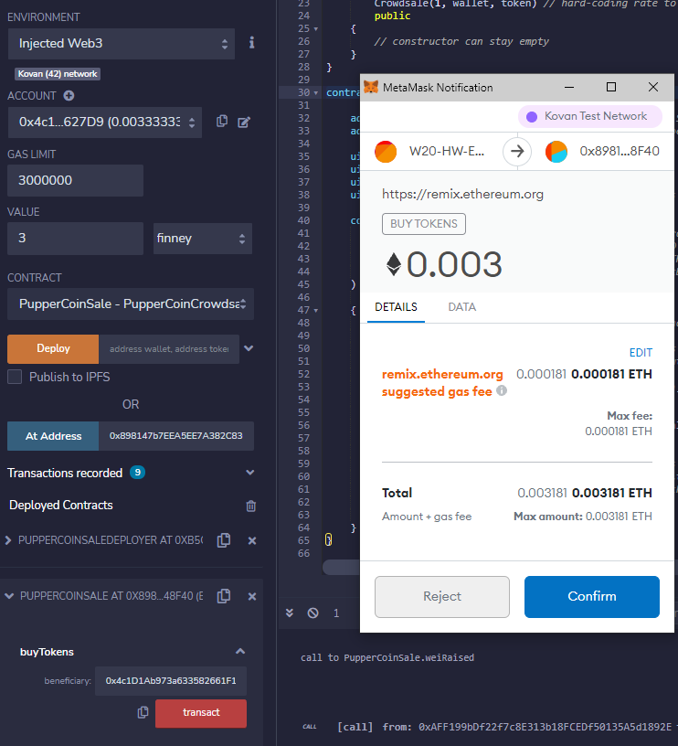
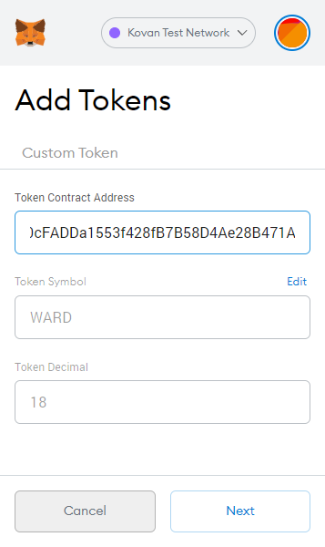

# blockchain-tokensale
This project is all about the creation of a token and working through a crowdsale of the token.  Within the period of the sale, limits of both time and total amount minted, are made.  OpenZeppelin's ERC standard contracts are used throughout (one has to be safe, you know!)

# Intro
## What is a Crowdsale
A Token Crowdsale is in essence the crowdfunding of a Token; that is it.  
A contract is created in which ETH is the primary currency accepted as payment for the token, and to the payee the minted token is then sent.  You give me Ether, I give you the Token.

### Adding complexity
A standard contract is always possible, but because OpenZeppelin makes life so easy, creating greater complexity within a Crowdsale is a synch.  
Open Zeppelin libraries/standards I have used: -
- Capped Crowdsale: a Crowdsale with a capped amount, once reached ends the sale.
- Timed Crowdsale: a Crowdsale with a time limit, once reached ends the sale.
- Refundbable Crowdsale: a Crowdsale with a funding goal, if not met, allows for refunds.

## Crowdsale Setup
This entire project is about the execution of a Token Crowdsale.  As mentions, OpenZeppelin provides industry standard interfaces and libraries, which enable an easy implementation of token standards.  In this case, I use the ERC20 standard for mintable Tokens, i.e. tokens that can be minted; as alluded to earlier, ETH is used to purchase the token and provided all limitations of the Crowdsale (time, goal, cap) are satisfied, the sale will conclude.

## Manifest
The files used in this project are: -
- `PupperCoin.sol`: The solidity that envokes the ERC20 standard and defines the use of the PupperCoin token.
- `PupperCoinCrowdsale.sol`: The solidity that allows for: -
  - the creation of the tokem
  - the creation of the Crowdsale contract (along with the stipulations as explained earlier)
  - the deployment of the token and the sale

### Highlighting the "Deployer"
Within `PupperCoinCrowdsale.sol`, a contract by the name of `PupperCoinSaleDeployer` is responsible for "constructing" the token, as well as the Crowdsale specific to this project.  So both are initiated as it were from the Deployer contract.  The great thing about the deployer and which I wanted to highlight, is that once it has completed the initiation/creation, it then relinquishes ownership to the `PupperCoinSale` Crowdsale contract and from then on, that contract is able to mint the token.

In order to complete the creation of the token and the sale, the following have to be passed (via the contract 'constructor') to the contract: -
> `rate`: the "exchange" rate of ETH to WARD  
> `wallet`: the wallet address to which the proceeds of the sale are sent  
> `token`: the token object itself, i.e. the AylwardCoin (WARD)  
> `cap`: the limit of the sale, when reached will end the sale  
> `duration`: the time limit of the sale, after which the sale will end  
> `goal`: the funding goal of the sale, if not me will allow for funds to be refunded  

# Testing
## Caveat
Though the deployment of the contracts are done on the Kovan Testnet (an actual Ethereum network although not Mainnet), the amounts of ETH (test-ETH) required are significant and so these tests are done with much smaller amounts.

## Setting up
In this section I want to show you how the Crowdsale is set up and prepared for.

One has to call `PupperCoinSaleDeployer` and initiate the creation of the token and create the Crowdsale.

> Note the Constructor inputs have been populated and `transact` selected  
> Metamask is connected and the contract prompts for the interaction  
> Clicking `Confirm` confirms the deployment of the contract.  

  

> The sale address is retreived in order to interact with `PupperCoinSale` (see next figure)  

  

> The Crowdsale is selected (figure on the left)  
> then loaded with the address of the Sale as retrieved  
> If you'd like to view the contract yourself, view it [here](https://kovan.etherscan.io/address/0x898147b7eea5ee7a382c8302485b8466c9e48f40).

  

> Note the attributes of the contract as described earlier.  
> As is visible, the sale is open with no limits having been reached as yet.
> Note the image on the right continues from that on the left.

  

## Purchasing WARD
In this section I want to show you the purchasing of the token.

> Now, connecting to the Kovan network with a different address some WARD tokens can be purchased with ETH  
> Note: the purchase is 0.003 ETH (or 3 finney)  
> And of course the purchase is confirmed in MetaMask  

  

> Once purchased, the balance of WARD can be seen in equal 1-to-1 ratio, e.g. 0.003 WARD for 3 finney  
> In order to confirm the balance, the getBalance() method is called for the address purchasing the WARD  

  

> The token purchase can be viewed on etherscan [here](https://kovan.etherscan.io/token/0x66fc9bd40cfadda1553f428fb7b58d4ae28b471a?a=0x4c1d1ab973a633582661f13c468cc0aebbe627d9)

  

> To add the token to your Metamask ...  
> Grab the token address and add it.  

  

## Hitting limits
In this section I want to show you how the contract tracks the limits and once hit, how the attribute values change.

> Please take some time and review in images above, what some of the attribute values are  
> Contrast those with what the values are now  
> For example: -
> - The time period of the Crowdsale has passed, and so is now closed
> - The cap set at the deploymnet of the contract was 3 finney (or 0.003 ETH).  This has been reached  
> - Similarly the funding goal was the same value and it too has been reached.

  

> To show visually, in a different way, I captured the epoch time for effect prioir to Crowdsale expiry.
> The unix epoch "converter" can be found [here](https://www.epochconverter.com/) for a bit of fun.

  

> Attempting to purchase more WARD with even the smallest amount errors as the Crowdsale is closed!  

  

# Conclusion
I trust you found walking through these Crowdsale contract interactions useful and that you learnt something.

Ethereum Improvement Proposals have led to a wonderful of standardised libraries and recommendations for implementing the creation of tokens, the structuring of Crowdsales, and all the great knowledge around these implementations contributed to and gained by the open source communicty.  Long may the good work of these communities, including OpenZeppelin and their contribution, continue!  

# Acknowledgements and References
- Remix has been used as the IDE for this little project
- Ganache has also been used to help with the testing off-chain
- I made use of the Chainlink Faucet for the ETH I used in this project, find that [here](https://faucets.chain.link/kovan)
- For the on-chain testing, I used the Kovan Testnet (more [here](https://kovan-testnet.github.io/website/))
- Learn all about OpenZeppelin and the standards of safety they provide at https://docs.openzeppelin.com but more specifically relating to Crowdsales [here](https://docs.openzeppelin.com/contracts/2.x/crowdsales)
- Ethereum Foundation needs to be acknowledged for their work, creating their blockchain, which allows for the deplyment and interaction with "smart-contracts"
- Thanks to Trinity College, an organisation that has provided the training which has allowed for the accomplishment of this demo (as part of a Monash University Bootcamp)